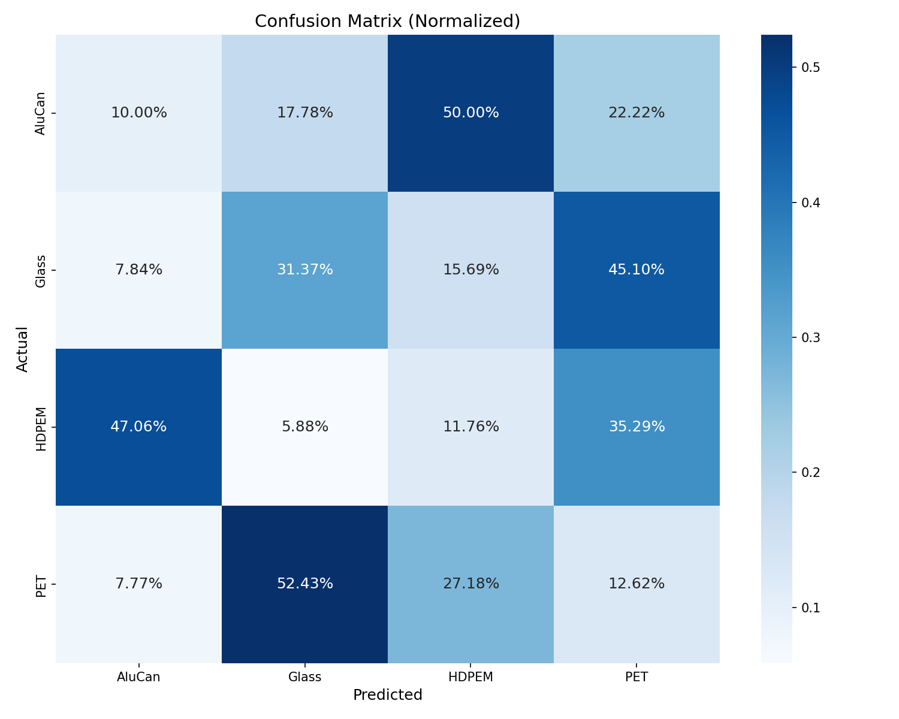

# Waste Object Detection Using Deep Learning  
### Academic Project Report Summary

This project focuses on detecting waste objects in images using deep learning.
The goal is to identify four recyclable material categories to support
automated waste sorting:

- **AluCan** (aluminium cans)  
- **Glass**  
- **HDPEM** (HDPE plastic bottles)  
- **PET** (PET plastic bottles)

We evaluated three different models:

1. **Custom ABFP Model**  
2. **ResNet50 Detector**  
3. **Pretrained YOLOv8** (reference baseline)

This README provides a concise academic summary of the dataset, models,
evaluation metrics, and qualitative results.

---

## Dataset Overview

- Total images: **4,811**  
- Classes: **4**  
- Train/Val split: **80% / 20%**  
- Annotation format: **YOLO bounding boxes**  
- Images include varied lighting, backgrounds, and object scales.

---

## Models Evaluated

### 1. **Custom ABFP Model (Main Model)**  
- YOLOv8 pretrained backbone (frozen)  
- Adaptive Bidirectional Feature Pyramid (ABFP)  
- Decoupled attention-based detection heads  
- Mixed-precision FP16 training  
- Trained for **30 epochs**

---

### 2. **ResNet50 Detector**  
- End-to-end training  
- High precision and recall  
- Most stable performance of the trained models  

---

### 3. **Pretrained YOLOv8 (Reference Model)**  
- Not fine-tuned on our dataset  
- Serves as a benchmark for pretrained large detectors  
- Achieves excellent results due to COCO-scale training  

---

## Evaluation Metrics

| Model | mAP@0.5 | Precision | Recall |
|-------|---------|-----------|--------|
| **Custom ABFP Model** | ~0.57 | ~0.40 | ~0.73 |
| **ResNet50 Detector** | 0.90+ | 0.90–1.00 | 0.85–1.00 |
| **YOLOv8 (Pretrained)** | 0.994 | 0.991 | 0.992 |

### Observations  
- ABFP detects many objects (high recall) but with many false positives (low precision).  
- ResNet50 provides strong, stable detection across all classes.  
- YOLOv8 performs best overall even without fine-tuning.

---

## Confidence Curves (Custom ABFP Model)

### F1-Score vs Confidence  

### Precision vs Confidence  

### Recall vs Confidence  

### Precision–Recall Curve  

These curves show that recall remains high, while precision drops quickly,
demonstrating the model’s tendency to overpredict.

---

## Confusion Matrices

### Custom ABFP Model  

### YOLOv8 (Reference)  

### ResNet50 Detector  

Interpretation:  
- ABFP struggles especially with PET and AluCan.  
- ResNet50 achieves the strongest class separation.  
- YOLOv8 approaches near-perfect classification.

---

## Qualitative Predictions

### Validation Batch Examples

---

### Individual Predictions

**PET example:**  

**Glass example:**  

**AluCan example:**  

**HDPEM example:**  

---

## Qualitative Results: Custom ABFP Model

Below are example predictions showing performance across HDPEM, Glass, PET, and AluCan
in varied lighting and backgrounds.

### ABFP Predictions (2×2 Grid)

<table align="center">
<tr>
<td align="center"> HDPEM Detection</td>
<td align="center"> Glass Detection</td>
</tr>
<tr>
<td align="center"> AluCan Detection</td>
<td align="center"> Additional Example</td>
</tr>
</table>

These visualisations show the strengths and weaknesses of the custom ABFP model.

---

## Key Insights

- **ABFP** shows good coverage (high recall) but many false positives.  
- **ResNet50** provides the best balance of accuracy, precision, and recall.  
- **YOLOv8** performs best overall even without dataset-specific training.  
- PET is the hardest category due to shape variation and reflective surfaces.  
- Additional training data, backbone fine-tuning, or stronger augmentation
  would improve performance.

---

## Conclusion

Deep learning models can effectively detect waste objects, but performance varies
significantly by architecture. While the custom ABFP model demonstrates that
lightweight feature pyramids can detect objects, it is outperformed by ResNet50
and YOLOv8. The comparison highlights the importance of strong backbones,
large datasets, and fine-tuning for robust waste detection.

This README provides a concise academic summary of the full project report.

---
